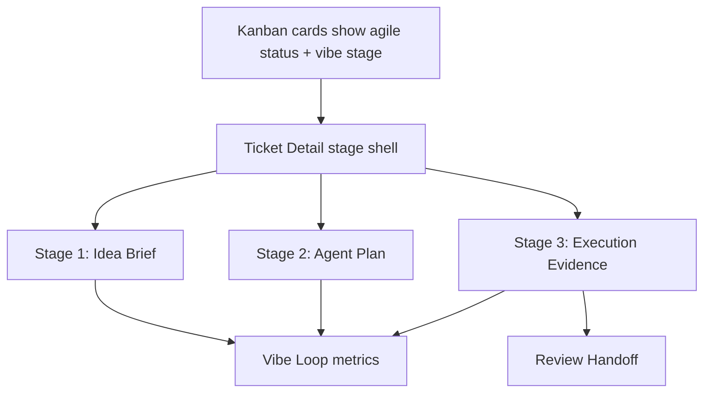
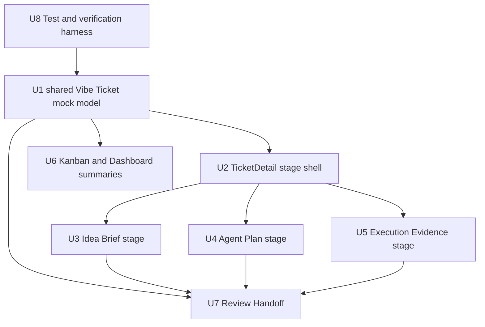

# feat: Implement three-stage Vibe Ticket UI

## Overview

This plan implements the three-stage Vibe Ticket control surface defined in `docs/brainstorms/2026-04-26-vibe-ticket-three-stage-requirements.md`: **Idea Brief → Agent Plan → Execution Evidence**.

**Current Status (2026-04-26):** The existing UI in `apps/vibeboard-ai-web` provides a solid brutalist/command-center foundation with established visual language, but **the three-stage Vibe Ticket structure has not been implemented yet**. All 8 implementation units (U1-U8) remain pending.

**What Exists:**
- ✅ Brutalist visual language (borders, shadows, color tokens) is well-established
- ✅ App shell (`TopNav`, `SideNav`) with basic navigation
- ✅ `TicketDetail.tsx` with split-panel layout (left content, right preview, bottom terminal)
- ✅ `Kanban.tsx` with agile columns and ticket cards
- ✅ `Dashboard.tsx` with agent HUD and KPI boxes
- ✅ `Review.tsx` with before/after diff viewer
- ✅ `Agents.tsx` with agent monitoring and conflict warnings
- ✅ `Settings.tsx` with AUTONOMY_LEVEL configuration

**What's Missing (All Units TODO):**
- ❌ Three-stage navigation (Brief → Plan → Evidence)
- ❌ Shared Vibe Ticket mock data model
- ❌ All stage-specific components (`IdeaBriefStage`, `AgentPlanStage`, `ExecutionEvidenceStage`)
- ❌ Context Pack selection UI
- ❌ Plan approval gate with risk/checkpoint display
- ❌ Evidence tree grouped by plan step
- ❌ Review Handoff summary connecting Brief/Plan/Evidence
- ❌ Vibe stage indicators on Kanban cards and Dashboard metrics
- ❌ Test harness for UI regression checks

The plan will reuse the existing visual language and layout foundation while building the three-stage product structure on top.

---

## Problem Frame

VibeBoard needs to feel like a vibe coding agile workflow, not just a board with an agent log. A user should be able to start from a raw idea, shape it into a structured brief, let an agent propose a plan, approve or revise that plan, watch execution evidence accrue by plan step, and review the result from evidence rather than from agent claims.

This plan focuses on the front-end prototype in `apps/vibeboard-ai-web`. It should express the product shape clearly with static/mock data first. Runtime agent orchestration, persistence, and real preview/evidence execution remain outside this implementation slice.

---

## Requirements Trace

- R1. Preserve and display the original idea / prompt in the Vibe Ticket detail.
- R2. Show target, expected change, acceptance criteria, constraints, non-goals, and target workspace in the Brief stage.
- R3. Represent allowed change scope in the Brief stage.
- R4. Represent evidence type selection, including UI preview, test/log evidence, and API response.
- R5. Show recommended Context Packs and selected injected context.
- R6. Show the agent's understanding summary before execution.
- R7. Show a step-by-step Agent Plan with step goals, expected outputs, and completion signals.
- R8. Show expected modified areas and scope risk.
- R9. Show risk level and checkpoint requirements.
- R10. Provide plan actions: Approve, Ask revision, Edit scope, Split ticket, Cancel.
- R11. Group execution evidence by plan step rather than time-only terminal logs.
- R12. Each evidence node should show type, summary, status, time, and raw log/artifact affordance.
- R13. Track file changes, commands, tests, preview state, corrections, and agent decisions as evidence.
- R14. Failed evidence should show reason, raw output, and recommended next step.
- R15. Let user corrections appear in the evidence tree.
- R16. Represent checkpoint behavior for high-risk or unplanned changes.
- R17. Review Handoff summarizes Brief, Plan, Evidence, Acceptance, risk, and changed scope.
- R18. Review supports Approve, Request changes, Re-run checks, and a visible Rollback checkpoint affordance.
- R19. Request changes feeds the next plan/execution loop.
- R20. Approve creates a Context Pack draft representation.
- R21. Ticket Detail uses three-stage navigation: Brief, Plan, Evidence.
- R22. Stage navigation displays stage status.
- R23. Board cards show current vibe stage in addition to agile status.
- R24. Dashboard shows Vibe Loop metrics such as Ready for Plan, Waiting Approval, Blocked by Checkpoint, Review Ready.

**Origin actors:** A1 Founder / 技术 PM, A2 全栈开发者, A3 AI Agent Operator, A4 AI Agent, A5 Reviewer / QA

**Origin flows:** F1 Idea 进入 Vibe Ticket, F2 Agent 生成并确认计划, F3 Agent 执行并沉淀证据, F4 Review 和复盘

**Origin acceptance examples:** AE1 covers R1/R2/R6, AE2 covers R8/R9/R10, AE3 covers R11/R13/R15, AE4 covers R4/R17, AE5 covers R19/R20

---

## Scope Boundaries

- Do not build real agent execution, file patching, persistence, or runtime evidence collection in this plan.
- Do not replace the app shell, pixel/brutalist visual direction, or current navigation model unless required to expose the new stages.
- Do not make Vite a product concept; keep Vite only as the app build tool and optional preview mock detail.
- Do not build a full Jira/Linear replacement, permission system, SSO, audit trail, or multi-agent swarm scheduler.
- Do not implement true rollback; show checkpoint/rollback as a review and evidence affordance only.
- Do not overfit the prototype to UI-only tasks; the UI must include non-UI evidence modes through mock data.

### Deferred to Follow-Up Work

- Real data model and persistence for Vibe Ticket stages, Context Packs, Evidence Nodes, and Review Handoffs.
- Real agent orchestration, patch application, command execution, and checkpoint resume behavior.
- Backend API integration and runtime preview/evidence execution.
- Drag-and-drop Kanban and state mutation behavior.

---

## Context & Research

### Relevant Code and Patterns

**Current Implementation Status:** Foundation exists, but no three-stage structure implemented yet.

- `apps/vibeboard-ai-web/src/App.tsx` controls route-like view switching through local state; use this pattern for any additional prototype view state.
- `apps/vibeboard-ai-web/src/views/TicketDetail.tsx` (175 lines) is the main target. Current layout: left panel (brief/acceptance), right panel (preview mock), bottom terminal. **Status:** Layout foundation exists, but content is static auth task mock. Needs complete refactor into stage shell + stage components.
- `apps/vibeboard-ai-web/src/views/Kanban.tsx` has ticket cards with agent progress and acceptance score. **Status:** Cards exist but show agile status only. Need to add vibe stage chips and evidence type indicators.
- `apps/vibeboard-ai-web/src/views/Dashboard.tsx` has KPI boxes and agent HUD. **Status:** Current metrics are agent-focused ("活跃代理小队", "验收通过率"). Need Vibe Loop metrics (Ready for Plan, Waiting Approval, etc.).
- `apps/vibeboard-ai-web/src/views/Review.tsx` has before/after visualization and Approve/Request changes actions. **Status:** Visual diff only. Need Review Handoff summary connecting Brief/Plan/Evidence.
- `apps/vibeboard-ai-web/src/views/Agents.tsx` communicates agent conflict risk. **Status:** Supporting context ready. Keep this as global monitoring; Vibe Ticket page should own per-ticket checkpoint UX.
- `apps/vibeboard-ai-web/src/views/Settings.tsx` exposes `AUTONOMY_LEVEL` setting. **Status:** Config exists but not reflected in Plan stage copy yet.
- `apps/vibeboard-ai-web/src/components/layout/SideNav.tsx` has active-state button pattern. **Status:** Reuse this pattern for stage navigation.
- `apps/vibeboard-ai-web/src/index.css` contains design tokens and brutalist utility classes. **Status:** Well-established. Reuse existing tokens; do not introduce another design system.
- **Visual Patterns to Reuse:**
  - Brutalist borders: `border-2 border-on-surface`, `brutal-border` class
  - Shadows: `shadow-[2px_2px_0px_0px_#1e1c0d]`, `brutal-shadow` class
  - Status chips: `px-2 py-0.5 border border-on-surface bg-primary-container text-white text-xs font-bold uppercase`
  - Material icons: `icon_name`
  - Section headers: `text-xl font-bold flex items-center gap-2 border-b-2 border-on-surface pb-4 uppercase`
  - Active buttons: `active:translate-x-[1px] active:translate-y-[1px] active:shadow-none`

### Institutional Learnings

- No `docs/solutions/` directory exists in this repo at planning time.

### External References

- External research is not required for this implementation plan. The work is a local React prototype restructure with strong origin requirements and existing UI patterns.

---

## Current UI Implementation Status (Updated 2026-04-26)

**Overall Assessment:** The existing UI provides a solid brutalist/command-center foundation with good visual language, but **NONE of the three-stage Vibe Ticket structure has been implemented yet**. All 8 implementation units (U1-U8) remain pending.

### Detailed Status by Area

| Area | Current State | Implementation Status | Gap to Address |
| --- | --- | --- | --- |
| **App shell** | `TopNav` and `SideNav` exist with brutalist styling, basic navigation works | ✅ Foundation ready | Navigation labels are generic (看板终端, 迭代任务); no Vibe Ticket stage awareness |
| **Ticket Detail** | `TicketDetail.tsx` has left panel (brief/acceptance), right panel (preview mock), bottom terminal | ⚠️ Layout exists, content wrong | **Missing:** stage navigation, original prompt display, context packs, plan approval gate, evidence tree, checkpoint UX. Current content is static mock for auth task. |
| **Kanban** | `Kanban.tsx` has 4 agile columns, ticket cards with progress/score | ⚠️ Cards exist, no vibe stage | Cards show agile status only; **missing:** vibe stage chips, evidence type indicators, waiting approval state, checkpoint blocked state |
| **Dashboard** | `Dashboard.tsx` has agent HUD, KPI boxes, terminal feed | ⚠️ Metrics exist, wrong focus | Current metrics: "首个证据生成时间", "活跃代理小队", "验收通过率"; **missing:** Vibe Loop metrics (Ready for Plan, Waiting Approval, Blocked by Checkpoint, Review Ready) |
| **Review** | `Review.tsx` has before/after diff viewer, approve/request changes buttons | ⚠️ Visual diff only | **Missing:** Review Handoff summary, Brief/Plan/Evidence links, risk summary, changed scope, re-run checks, rollback checkpoint, Context Pack draft |
| **Agents** | `Agents.tsx` has agent monitoring, conflict warnings | ✅ Supporting context ready | Not connected to per-ticket checkpoint behavior yet |
| **Settings** | `Settings.tsx` has AUTONOMY_LEVEL setting | ✅ Config ready | Not reflected in Plan stage copy yet |
| **Mock Data** | No shared mock data structure exists | ❌ Not started | Need `vibeTicketMock.ts` and `vibeTicket.ts` types |
| **Components** | Only layout components exist (`TopNav`, `SideNav`) | ❌ Not started | No `components/vibe-ticket/` directory; all stage components missing |
| **Tests** | No test setup beyond TypeScript compilation | ❌ Not started | Need test harness (U8) before other units can add tests |

### Key Findings

1. **Visual Language:** The brutalist/pixel aesthetic is well-established and consistent. Reuse existing border styles, shadows, color tokens.
2. **Layout Foundation:** The split-panel layout in `TicketDetail.tsx` can be adapted for stage-based content without major restructure.
3. **Component Extraction:** Current views are monolithic (142-175 lines). Stage components will need proper extraction to `components/vibe-ticket/`.
4. **No Vibe Ticket Concept Yet:** The current UI treats tickets as traditional agile tasks. The three-stage mental model (Brief → Plan → Evidence) is completely absent.
5. **Mock Data Scattered:** Each view has inline mock data. Need centralized `vibeTicketMock.ts` for consistency.

### Implementation Priority

All 8 units remain **TODO**. Recommended execution order:
1. **U8 first** (test harness) - enables regression checks for all other units
2. **U1** (shared mock model) - unblocks all UI units
3. **U2** (stage shell) - establishes the three-stage structure
4. **U3, U4, U5** (stage content) - can proceed in parallel after U2
5. **U6** (Kanban/Dashboard) - can proceed in parallel with U3-U5
6. **U7** (Review Handoff) - depends on U3, U4, U5 for full context

---

## Key Technical Decisions

- **Implementation Status:** All 8 units remain TODO. The existing UI provides visual language and layout foundation, but no three-stage structure exists yet.
- Keep the first implementation mock-driven: static data in the front-end is enough to validate the page structure before backend design.
- Introduce small shared mock/domain objects rather than scattering stage/evidence strings across views. This keeps Ticket Detail, Kanban, Dashboard, and Review consistent.
- Refactor `TicketDetail.tsx` into stage-oriented subcomponents before adding more UI detail. The file is already 175 lines; adding all three stages inline would make the prototype hard to iterate.
- Treat `Execution Evidence` as the primary visual artifact and keep raw terminal logs as a supporting drawer, not the main timeline.
- Support at least three evidence modes in UI copy and mock data: UI preview, test/log evidence, API response. This prevents the product from regressing into a front-end-only preview board.
- Add a lightweight test harness as part of this work (U8); current `package.json` has `lint` via TypeScript but no UI test command, and the three-stage UI needs regression checks for visible labels and stage switching.
- **Reuse existing visual patterns:** Brutalist borders (`border-2 border-on-surface`), shadows (`shadow-[2px_2px_0px_0px_#1e1c0d]`), status chips, material icons, uppercase labels, and color tokens from `index.css`.

---

## Open Questions

### Resolved During Planning

- Should current UI be reused or replaced? Reuse. The existing brutalist/pixel command-center style and layout pieces already fit the product direction well enough.
- Should the plan build real agent/runtime behavior now? No. The origin scope and current app maturity point to a mock-driven UI prototype first.
- Should Vibe Ticket stage state replace agile status? No. Board cards and headers should show both: agile status for delivery workflow and vibe stage for AI-agent workflow.

### Deferred to Implementation

- Exact mock data shape for evidence artifacts: decide while extracting shared mock data from the current view examples.
- Final choice of exact test dependencies: use the smallest React-compatible setup that supports rendering components and querying user-visible labels.
- Final responsive behavior for the three-stage Ticket Detail layout: tune after seeing the actual screen density.

---

## High-Level Technical Design

> *This illustrates the intended approach and is directional guidance for review, not implementation specification. The implementing agent should treat it as context, not code to reproduce.*

The page should feel like a single Vibe Ticket moving through stages, not separate unrelated screens. Kanban and Dashboard summarize stage state; Ticket Detail is where the stage work happens; Review Handoff is the decision surface.

---

## Implementation Units

- U1. **Create shared Vibe Ticket mock model**

**Goal:** Establish one mock source of truth for ticket stages, evidence types, plan steps, context packs, acceptance results, and review handoff data.

**Requirements:** R1-R5, R6-R20, R22-R24; supports F1-F4 and AE1-AE5.

**Dependencies:** None

**Implementation Status:** ❌ **TODO** - No mock data structure exists yet. Current views have inline static data that needs to be centralized.

**Files:**
- Create: `apps/vibeboard-ai-web/src/data/vibeTicketMock.ts`
- Create: `apps/vibeboard-ai-web/src/types/vibeTicket.ts`
- Modify: `apps/vibeboard-ai-web/src/views/TicketDetail.tsx` (replace inline mock with shared data)
- Modify: `apps/vibeboard-ai-web/src/views/Kanban.tsx` (replace inline mock with shared data)
- Modify: `apps/vibeboard-ai-web/src/views/Dashboard.tsx` (replace inline mock with shared data)
- Modify: `apps/vibeboard-ai-web/src/views/Review.tsx` (replace inline mock with shared data)
- Test: `apps/vibeboard-ai-web/src/data/vibeTicketMock.test.ts`

**Approach:**
- Define prototype-level types for `VibeStage`, `AgileStatus`, `EvidenceType`, `PlanStep`, `EvidenceNode`, `ContextPack`, and `ReviewHandoff`.
- Move hard-coded ticket examples toward shared mock data so stage labels and counts stay consistent across screens.
- Include at least one UI task, one API/integration task, and one test/log evidence task in mock data.
- **Current state:** Each view has its own inline mock data. `TicketDetail.tsx` has auth task mock, `Dashboard.tsx` has agent HUD mock, `Kanban.tsx` has card mock. These need to be unified.

**Patterns to follow:**
- Existing static mock style in `TicketDetail.tsx`, `Kanban.tsx`, and `Dashboard.tsx`.
- Existing uppercase status-chip visual language.

**Test scenarios:**
- Happy path: mock ticket has Brief, Plan, Evidence, Review handoff data and can be imported without type errors.
- Happy path: mock tickets include at least three evidence types: UI preview, test/log evidence, API response.
- Edge case: a ticket with a failed evidence node still has a recommended next step and checkpoint status.
- Integration: Dashboard and Kanban can derive counts/stage labels from the shared mock data rather than duplicating separate literals.

**Verification:**
- A developer can identify the current sample ticket, its active vibe stage, evidence nodes, context packs, and review handoff from one shared mock module.

---

- U2. **Refactor Ticket Detail into a three-stage shell**

**Goal:** Convert `TicketDetail.tsx` from one static detail layout into a stage-based control surface with header, stage nav, primary panel, side panel, and evidence drawer.

**Requirements:** R21, R22; supports F1-F3.

**Dependencies:** U1

**Implementation Status:** ❌ **TODO** - Current `TicketDetail.tsx` (175 lines) has split-panel layout but no stage navigation. Content is static auth task mock. Needs complete refactor.

**Files:**
- Modify: `apps/vibeboard-ai-web/src/views/TicketDetail.tsx` (refactor into stage shell)
- Create: `apps/vibeboard-ai-web/src/components/vibe-ticket/StageNav.tsx`
- Create: `apps/vibeboard-ai-web/src/components/vibe-ticket/TicketHeader.tsx`
- Create: `apps/vibeboard-ai-web/src/components/vibe-ticket/EvidenceDrawer.tsx`
- Test: `apps/vibeboard-ai-web/src/components/vibe-ticket/StageNav.test.tsx`
- Test: `apps/vibeboard-ai-web/src/views/TicketDetail.test.tsx`

**Approach:**
- Keep the current high-level spatial model (left content, right preview, bottom terminal) but insert a visible stage nav: Brief → Plan → Evidence → Review.
- Show both agile state and vibe stage in the header.
- Use local state for selected stage in the prototype.
- Keep raw terminal logs in a lower drawer; avoid making it the main evidence experience.
- **Current state:** `TicketDetail.tsx` has left panel with brief/acceptance, right panel with preview mock, bottom terminal. No stage concept exists. File is 175 lines and needs component extraction.

**Patterns to follow:**
- Current `TicketDetail.tsx` brutal border, split-panel, and terminal styles.
- `SideNav.tsx` button active-state pattern for stage navigation (green bg when active, border shadow).

**Test scenarios:**
- Covers F1/F2/F3. Happy path: clicking Brief, Plan, and Evidence stage controls changes the primary panel content.
- Covers R22. Happy path: every stage nav item displays a stage status label.
- Edge case: when selected ticket is missing, the screen still renders a safe fallback title and does not crash.
- Integration: Ticket header displays agile status and vibe stage simultaneously.

**Verification:**
- Ticket Detail visibly exposes the three-stage structure without losing preview and terminal affordances from the current prototype.

---

- U3. **Build Stage 1: Idea Brief panel**

**Goal:** Add the Brief stage content that captures original idea, target, expected change, acceptance criteria, constraints, non-goals, workspace, scope, evidence type, and Context Pack selection.

**Requirements:** R1-R5; supports F1 and AE1.

**Dependencies:** U1, U2

**Files:**
- Create: `apps/vibeboard-ai-web/src/components/vibe-ticket/IdeaBriefStage.tsx`
- Create: `apps/vibeboard-ai-web/src/components/vibe-ticket/ContextPackPanel.tsx`
- Modify: `apps/vibeboard-ai-web/src/views/TicketDetail.tsx`
- Test: `apps/vibeboard-ai-web/src/components/vibe-ticket/IdeaBriefStage.test.tsx`
- Test: `apps/vibeboard-ai-web/src/components/vibe-ticket/ContextPackPanel.test.tsx`

**Approach:**
- Present the original idea/prompt as a first-class block, not hidden inside description.
- Use compact labeled panels for target, expected change, constraints, non-goals, allowed scope, workspace, and evidence type.
- Show recommended Context Packs in the side panel with selected/unselected states.
- Add actions as prototype buttons: Save brief, Ask AI to clarify, Generate Agent Plan.

**Patterns to follow:**
- Current `TicketDetail.tsx` section header style with material icons.
- Current check-list styling for acceptance criteria.

**Test scenarios:**
- Covers AE1. Happy path: a raw idea is visible before any Agent Plan content.
- Happy path: acceptance criteria, constraints, non-goals, workspace, and allowed scope are all displayed for the sample ticket.
- Happy path: Context Pack recommendations show selected context that will be injected into planning.
- Edge case: when no Context Pack is recommended, the side panel shows an empty state that invites manual context selection.

**Verification:**
- A viewer can answer: “What did the user originally ask for, what is in scope, what is out of scope, and what context will the agent use?”

---

- U4. **Build Stage 2: Agent Plan approval gate**

**Goal:** Add the Plan stage that shows Agent understanding, step-by-step plan, expected modified areas, test/evidence plan, risk, checkpoint list, autonomy policy, and plan actions.

**Requirements:** R6-R10, R16; supports F2 and AE1-AE2.

**Dependencies:** U1, U2, U3

**Files:**
- Create: `apps/vibeboard-ai-web/src/components/vibe-ticket/AgentPlanStage.tsx`
- Create: `apps/vibeboard-ai-web/src/components/vibe-ticket/PlanStepCard.tsx`
- Create: `apps/vibeboard-ai-web/src/components/vibe-ticket/RiskCheckpointPanel.tsx`
- Modify: `apps/vibeboard-ai-web/src/views/TicketDetail.tsx`
- Test: `apps/vibeboard-ai-web/src/components/vibe-ticket/AgentPlanStage.test.tsx`
- Test: `apps/vibeboard-ai-web/src/components/vibe-ticket/RiskCheckpointPanel.test.tsx`

**Approach:**
- Show an “Agent understanding” summary at the top so users can judge intent before implementation.
- Render plan steps as cards with expected output and completion signal.
- Highlight scope risk when expected files/modules exceed the Brief's allowed scope.
- Represent actions as UI controls: Approve plan, Ask revision, Edit scope, Split ticket, Cancel.
- Surface the current autonomy policy from mock data using language consistent with `Settings.tsx`.

**Patterns to follow:**
- Current warning panel pattern from `Agents.tsx` for risk/checkpoint warnings.
- Existing primary/secondary destructive action button styles in `Review.tsx` and `Settings.tsx`.

**Test scenarios:**
- Covers AE1. Happy path: Agent understanding summary appears before plan steps.
- Covers AE2. Happy path: a plan with out-of-scope modifications shows a visible scope risk warning.
- Happy path: all five plan actions are visible.
- Error path: high-risk step displays checkpoint-required state rather than appearing as normal execution.
- Integration: selected Context Packs from Brief appear in the Plan side panel.

**Verification:**
- A user can decide whether to approve the plan without reading code or inferring risk from a terminal log.

---

- U5. **Build Stage 3: Execution Evidence tree**

**Goal:** Replace terminal-first execution presentation with evidence grouped by plan step while preserving raw logs as a secondary drawer.

**Requirements:** R11-R16; supports F3 and AE3-AE4.

**Dependencies:** U1, U2, U4

**Files:**
- Create: `apps/vibeboard-ai-web/src/components/vibe-ticket/ExecutionEvidenceStage.tsx`
- Create: `apps/vibeboard-ai-web/src/components/vibe-ticket/EvidenceNodeCard.tsx`
- Create: `apps/vibeboard-ai-web/src/components/vibe-ticket/EvidenceSidePanel.tsx`
- Modify: `apps/vibeboard-ai-web/src/components/vibe-ticket/EvidenceDrawer.tsx`
- Modify: `apps/vibeboard-ai-web/src/views/TicketDetail.tsx`
- Test: `apps/vibeboard-ai-web/src/components/vibe-ticket/ExecutionEvidenceStage.test.tsx`
- Test: `apps/vibeboard-ai-web/src/components/vibe-ticket/EvidenceNodeCard.test.tsx`

**Approach:**
- Group evidence under plan step headings.
- Each evidence node should show type, status, timestamp, summary, and raw artifact/log affordance.
- Include node variants for file change, command, test, preview, API response, user correction, agent decision, error, and checkpoint.
- Side panel changes by evidence type: UI preview, API response, or test/log result.
- Keep the existing terminal visual style as raw log drawer content, not the main event structure.

**Patterns to follow:**
- Current terminal line styling in `TicketDetail.tsx` for raw logs.
- Existing card status colors from `Kanban.tsx` and `Review.tsx`.

**Test scenarios:**
- Covers AE3. Happy path: failed step shows file read/write, command output, failure reason, and user correction in the same plan-step group.
- Covers AE4. Happy path: API evidence mode renders request/response evidence instead of iframe-only preview.
- Error path: failed evidence node shows recommended next step and checkpoint affordance.
- Edge case: a plan step with no evidence yet renders pending state without breaking layout.
- Integration: Move to Review action appears only when mock acceptance/evidence state is review-ready.

**Verification:**
- A viewer can answer: “For each plan step, what evidence proves progress or explains failure?”

---

- U6. **Update Kanban and Dashboard summaries for vibe stages**

**Goal:** Make board and dashboard reflect the new Vibe Loop so users see where work is blocked: Ready for Plan, Waiting Approval, Running, Blocked by Checkpoint, Review Ready.

**Requirements:** R22-R24; supports F1-F3.

**Dependencies:** U1

**Files:**
- Modify: `apps/vibeboard-ai-web/src/views/Kanban.tsx`
- Modify: `apps/vibeboard-ai-web/src/views/Dashboard.tsx`
- Test: `apps/vibeboard-ai-web/src/views/Kanban.test.tsx`
- Test: `apps/vibeboard-ai-web/src/views/Dashboard.test.tsx`

**Approach:**
- Add compact vibe stage chips to ticket cards while preserving agile columns.
- Show evidence type and approval/checkpoint state on cards where relevant.
- Replace or augment dashboard KPIs with Vibe Loop metrics.
- Add a small “waiting for human” or “checkpoint blocked” visual signal for tickets needing action.

**Patterns to follow:**
- Current `TicketCard` progress/score chip structure.
- Current `KPIBox` component pattern in `Dashboard.tsx`.

**Test scenarios:**
- Covers R23. Happy path: each Kanban card displays agile column state and vibe stage.
- Happy path: a waiting-approval ticket displays a human-action-needed indicator.
- Happy path: dashboard shows Ready for Plan, Waiting Approval, Blocked by Checkpoint, and Review Ready counts.
- Edge case: done tickets still show final vibe stage without visually competing with Done status.

**Verification:**
- The board communicates both delivery status and AI-agent workflow bottleneck at a glance.

---

- U7. **Upgrade Review into Review Handoff decision surface**

**Goal:** Extend `Review.tsx` from visual diff mock into a Review Handoff page that connects Brief, Plan, Evidence, Acceptance, risk, changed files, and Context Pack draft.

**Requirements:** R17-R20; supports F4 and AE4-AE5.

**Dependencies:** U1, U3, U4, U5

**Files:**
- Modify: `apps/vibeboard-ai-web/src/views/Review.tsx`
- Create: `apps/vibeboard-ai-web/src/components/vibe-ticket/ReviewHandoffSummary.tsx`
- Create: `apps/vibeboard-ai-web/src/components/vibe-ticket/ContextPackDraft.tsx`
- Test: `apps/vibeboard-ai-web/src/views/Review.test.tsx`
- Test: `apps/vibeboard-ai-web/src/components/vibe-ticket/ReviewHandoffSummary.test.tsx`

**Approach:**
- Preserve before/after visual diff as one evidence section, not the whole review.
- Add What changed, Why it changed, Evidence summary, Acceptance results, Risk summary, Changed files, and Context Pack draft.
- Add Re-run checks and Rollback checkpoint affordances to the decision bar.
- Make Request changes visibly feed back into the next Plan/Execution loop through copy and mock status.

**Patterns to follow:**
- Existing `Review.tsx` split viewer and decision button patterns.
- Existing checklist component style for acceptance and risk items.

**Test scenarios:**
- Covers AE4. Happy path: API/test evidence appears in review handoff when evidence type is non-UI.
- Covers AE5. Happy path: Request changes message indicates it feeds next Agent Plan input.
- Happy path: Context Pack draft includes prompt, final plan, key evidence, successful checks, and conventions.
- Edge case: skipped acceptance checks are shown as skipped rather than passing.

**Verification:**
- Reviewer can make Approve / Request changes / Re-run checks / Rollback checkpoint decisions based on summarized evidence and risk.

---

- U8. **Add front-end verification harness**

**Goal:** Ensure the new prototype structure can be regression-checked beyond TypeScript compilation.

**Requirements:** Supports all feature-bearing requirements by making UI state visible and testable.

**Dependencies:** None; do this before or alongside U1 so other units can add tests as they land.

**Implementation Status:** ❌ **TODO** - No test setup exists beyond TypeScript compilation. `package.json` has `lint` script but no test command.

**Files:**
- Modify: `apps/vibeboard-ai-web/package.json` (add test script and dependencies)
- Modify: `apps/vibeboard-ai-web/tsconfig.json` (add test configuration if needed)
- Create: `apps/vibeboard-ai-web/src/test/setup.ts`
- Create: `apps/vibeboard-ai-web/src/test/render.tsx`
- Test: `apps/vibeboard-ai-web/src/views/TicketDetail.test.tsx` (example test to verify harness works)

**Approach:**
- Add a lightweight React test setup appropriate for the current Vite + React app.
- Keep the test setup minimal: it only needs to render components and query user-visible labels/states for this prototype pass.
- Prefer testing user-visible labels and stage transitions rather than implementation details.
- **Current state:** No test infrastructure exists. Only TypeScript compilation via `lint` script.

**Patterns to follow:**
- Existing `lint` script in `apps/vibeboard-ai-web/package.json`.
- Keep test helpers under `apps/vibeboard-ai-web/src/test/` so they are local to the app.

**Test scenarios:**
- Happy path: test harness can render `TicketDetail` and query Brief, Plan, Evidence stage labels.
- Happy path: test harness can render `Kanban` and query vibe stage chips.
- Error path: if dependency installation fails in the execution environment, record the failure and fall back to TypeScript compilation plus manual visual scenarios for that run.

**Verification:**
- The implementer has an automated UI verification path for the stage labels, card summaries, and review handoff; if dependency installation is blocked, the fallback is explicitly documented during execution.

---

## System-Wide Impact

- **Interaction graph:** `App.tsx` remains the simple view switcher; new stage state should stay within Ticket Detail unless later persistence requires lifting state.
- **Error propagation:** Prototype-only UI errors should fail gracefully with empty/mock states rather than crashing the page when mock sections are missing.
- **State lifecycle risks:** The UI now has two state axes: agile status and vibe stage. Components should not conflate them.
- **API surface parity:** No real API surface changes in this plan. Mock data should be shaped so future backend integration can map to it without renaming product concepts.
- **Integration coverage:** Cross-view consistency matters: Kanban card stage, Dashboard counts, Ticket Detail stage, and Review Handoff should reflect the same mock ticket status.
- **Unchanged invariants:** Keep the existing app shell, pixel/brutalist style, current route-like view switching, and current VibeBoard naming.

---

## Risks & Dependencies

| Risk | Mitigation |
|------|------------|
| Ticket Detail becomes too dense | Use stage navigation and side panels; keep raw terminal logs in a drawer. |
| Product regresses to UI-preview-only | Include API and test/log evidence modes in mock data and UI. |
| Vibe stage conflicts with agile status | Show both explicitly and use distinct labels/colors. |
| Large component file becomes unmaintainable | Extract stage and card components under `components/vibe-ticket/`. |
| Automated test setup adds dependency churn | Keep U8 minimal and focused on rendering components/querying visible labels; fall back to lint/manual verification only if dependency installation is blocked during execution. |
| Mock data overfits the first sample ticket | Include at least three different task/evidence examples in shared mock data. |

---

## Documentation / Operational Notes

- Update `docs/product/ui-information-architecture.md` after implementation if the final screen structure differs materially from the requirements doc.
- If U8 adds a test command, update `apps/vibeboard-ai-web/README.md` with the verification command.
- Keep `docs/brainstorms/2026-04-26-vibe-ticket-three-stage-requirements.md` as the product source of truth; do not duplicate the full requirement text in code comments.

---

## Next Steps & Execution Readiness

**Plan Status:** Updated 2026-04-26 after reviewing current implementation. All 8 units remain TODO.

**Recommended Execution Order:**
1. **U8** (test harness) - Establish regression checks first
2. **U1** (shared mock model) - Unblocks all UI units
3. **U2** (stage shell) - Establishes three-stage structure
4. **U3, U4, U5** (stage content) - Can proceed in parallel after U2
5. **U6** (Kanban/Dashboard) - Can proceed in parallel with U3-U5
6. **U7** (Review Handoff) - Depends on U3, U4, U5 for full context

**Key Risks:**
- Ticket Detail density: Mitigate by using stage navigation and side panels; keep raw terminal logs in a drawer.
- Component file size: Extract stage components under `components/vibe-ticket/` early (U2).
- Mock data overfitting: Include at least three different task/evidence examples in shared mock data (U1).

**Ready to Start:** Yes. The plan is complete, requirements are clear, and the existing UI foundation is well-understood.

---

## Sources & References

- **Origin document:** [docs/brainstorms/2026-04-26-vibe-ticket-three-stage-requirements.md](../brainstorms/2026-04-26-vibe-ticket-three-stage-requirements.md)
- Related UI: `apps/vibeboard-ai-web/src/views/TicketDetail.tsx`
- Related UI: `apps/vibeboard-ai-web/src/views/Kanban.tsx`
- Related UI: `apps/vibeboard-ai-web/src/views/Dashboard.tsx`
- Related UI: `apps/vibeboard-ai-web/src/views/Review.tsx`
- Related UI: `apps/vibeboard-ai-web/src/views/Agents.tsx`
- Related UI: `apps/vibeboard-ai-web/src/views/Settings.tsx`
- Related docs: `docs/product/ui-information-architecture.md`
- Related docs: `docs/technical/data-model.md`
- Related docs: `docs/technical/agent-design.md`
