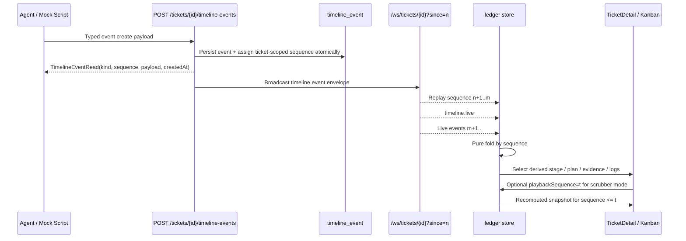
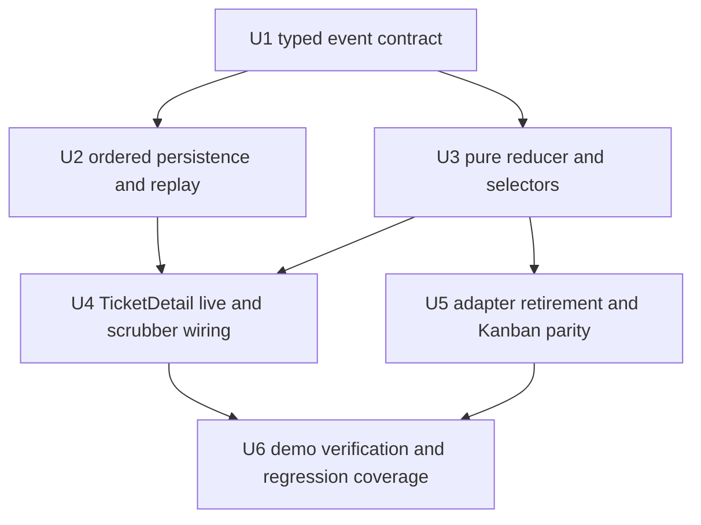

# feat: Typed Event Ledger, Live Reducer, and Replay Scrubber

## Overview

Replace the current mixed transport-plus-adapter state path with a typed event ledger that becomes the single source of truth for `vibeStage`, plan-step status, evidence-node status, and terminal logs. The backend will own the typed event contract and replay semantics; the frontend will own a pure reducer plus replay-aware selectors; `TicketDetail`, `Kanban`, and related views will stop synthesizing the same state in multiple places.

This is not greenfield work. The repo already contains partial implementation in `apps/api/src/models/timeline.py`, `apps/api/src/api/routes/timeline_events.py`, `apps/api/src/api/websocket/timeline_ws.py`, `apps/vibeboard-ai-web/src/store/ledgerStore.ts`, and `apps/vibeboard-ai-web/src/views/TicketDetail.tsx`, but the current shape is still structurally split between backend enum + freeform payloads, frontend adapter heuristics, and a reducer that does not yet own all event-derived state.

---

## Problem Frame

The origin document identifies a specific solo-dev pain: event transport exists, but derived UI state does not update reliably after live events. `ticketAdapters.ts` still synthesizes `vibeStage`, `plan`, and `evidence` during HTTP fetch, while WebSocket updates only append to `timelineEvents[]`. That leaves evidence nodes stuck at `running`, stage progression out of sync, terminal logs disconnected from evidence nodes, and no native way to scrub back through a run to inspect when a node changed state.

The repo confirms the same drift in code:

- `apps/vibeboard-ai-web/src/api/ticketAdapters.ts` still derives `vibeStage`, `plan`, `evidence`, and review summaries from fetched ticket detail plus legacy timeline event heuristics.
- `apps/vibeboard-ai-web/src/store/ledgerStore.ts` has started a reducer path, but it only derives `vibeStage`, evidence nodes, and terminal logs; it does not own plan-step state, card-stage parity, or a strict replay/live state machine.
- `apps/vibeboard-ai-web/src/views/TicketDetail.tsx` still seeds the store from `toVibeTicketDetail(detail)` and then layers event updates on top, so the adapter remains a competing truth source.
- `apps/vibeboard-ai-web/src/views/Kanban.tsx` still groups cards by `ticket.status` and uses `toVibeTicketSummary`, which is incompatible with AE2’s requirement that a `StagePatch` move the ticket between stage-based columns without a `PATCH /tickets/:id` update.

The plan therefore needs to do more than “add more event kinds”. It must lock three architectural boundaries before implementation expands further:

1. **Backend typed event schema ownership** — the backend must own the event contract and OpenAPI surface.
2. **Single reducer ownership boundary** — event-derived fields must be folded in one place, then exposed through selectors.
3. **Explicit replay-to-live semantics** — reconnect, catch-up, and scrubber mode must be modeled deliberately rather than inferred from append-only arrays.

---

## Requirements Trace

- R1. Support the v1 event taxonomy: `StagePatch | PlanStepStatusPatch | EvidenceNodePatch | TerminalLogAppend | Checkpoint` with OpenAPI-exported typed payload schemas.
- R2. Keep `AutonomyPromptOpened` / `UserCorrection` out of the v1 end-to-end flow while leaving room for future extension.
- R3. Make patch payload schemas the authoritative source for evidence and related derived fields.
- R4. Remove stored `vibeStage` authority and derive it from the ledger; ensure Kanban receives the same derived answer.
- R5. Make `EvidenceStage`, `PlanStage`, and `TerminalDrawer` read reducer state rather than adapter-synthesized state.
- R6. Enforce per-ticket monotonic `sequence` ordering as the authoritative fold order and handle out-of-order arrival safely.
- R7. Route every event-derived display through the ledger reducer and forbid backfilling the same fields from `getTicketDetail`.
- R8. Support `?since=<sequence>` replay with a `timeline.live` boundary event and client-held `lastAppliedSequence`.
- R9. Add a scrubber-driven replay UI to `TicketDetail` with event-aware ticks and hover summary.
- R10. Differentiate replay mode and live mode clearly.
- R11. Pass the main solo-dev demo where a running evidence node flips to success live without refresh and terminal/evidence are linked by `nodeId`.
- R12. Pass the failure + rewind demo where the scrubber reveals the earlier `running` state and the latest state shows `failed` plus `failureReason`.

**Origin actors:** A1 Founder / 技术 PM, A2 全栈开发者, A3 AI Agent Operator, A4 AI Agent, A5 Reviewer / QA

**Origin flows:** F1 实时派生状态, F2 时间拖条回看, F3 重连 / 迟到加入

**Origin acceptance examples:** AE1 (R1, R3, R6, R11), AE2 (R4, R5), AE3 (R8), AE4 (R9, R10), AE5 (R7)

---

## Scope Boundaries

- v1 does not implement `AutonomyPromptOpened` / `UserCorrection` end-to-end.
- v1 does not add branch/fork timelines, multi-client conflict resolution, ledger archival, trace export, or >10k cold-open optimizations.
- v1 does not preserve backward compatibility with the old 9-value timeline model. The origin explicitly prefers replacement plus SQLite reset.
- v1 does not add checkpoint-only jump lists or bisect tools; rewind is scrubber-only.
- This plan does not broaden the product surface into new agent workflows. It only makes existing stage/evidence/terminal transport coherent and replayable.

### Deferred to Follow-Up Work

- Additional event kinds for autonomy prompts and user correction feedback.
- Snapshot/checkpoint-based replay acceleration if event counts make cold-open replay visibly slow.
- Export/trace tooling built on top of the ledger once the reducer contract is stable.

---

## Context & Research

### Relevant Code and Patterns

- `docs/brainstorms/2026-04-28-typed-event-ledger-requirements.md`: Origin product and contract document for this plan.
- `docs/plans/2026-04-27-002-feat-python-backend-architecture-plan.md`: Established FastAPI + SQLModel + WebSocket + OpenAPI direction; explicitly left replay semantics and payload policy as follow-up questions.
- `apps/api/src/models/timeline.py`: Current timeline model. It already includes `sequence` and new event enum values, but still models event payloads as freeform `dict[str, Any]` under `type`.
- `apps/api/src/api/routes/timeline_events.py`: REST event ingest and list endpoints. It currently supports `since`, sequence ordering, and live broadcast, but sequence allocation is still application-level `MAX(sequence)+1` logic.
- `apps/api/src/api/websocket/timeline_ws.py`: Current replay-then-live WebSocket endpoint. It already accepts `since` and emits `timeline.live`, which is the right boundary concept for R8.
- `apps/api/src/api/routes/tickets.py`: Ticket detail still returns raw `timelineEvents` and no reducer-derived stage projection.
- `apps/api/src/models/ticket.py`: `TicketDetailRead` aggregates acceptance criteria and raw timeline events, but does not expose reducer-derived stage/snapshot fields.
- `apps/vibeboard-ai-web/src/api/ticketAdapters.ts`: Still the largest source of multi-truth drift. It synthesizes summary/detail stage, plan, evidence, review, terminal log shaping, and event-to-node heuristics.
- `apps/vibeboard-ai-web/src/store/ledgerStore.ts`: Introduced Zustand, `lastAppliedSequence`, playback state, and a partial reducer path, but currently mixes transport buffering, domain reduction, and UI formatting.
- `apps/vibeboard-ai-web/src/views/TicketDetail.tsx`: Seeds store state from `toVibeTicketDetail(detail)` and then appends WebSocket events; scrubber UI exists but is still wired to a partially derived store.
- `apps/vibeboard-ai-web/src/views/Kanban.tsx`: Still list-fetch driven and grouped by `agileStatus`; uses `toVibeTicketSummary` instead of reducer-owned stage projection.
- `apps/api/tests/test_timeline_ws.py`: Existing baseline tests cover `timeline.live` and broadcast, but not replay gap safety, duplicate fold prevention, or sequence monotonicity under concurrent writes.
- `apps/vibeboard-ai-web/src/views/TicketDetail.test.tsx`: Existing UI tests cover live append only, not event-derived status flips, replay mode, or scrubber semantics.

### Institutional Learnings

- `findings.md`: Captures the exact failure mode of adapter synthesis and identifies the sequence race condition risk in SQLite.
- `task_plan.md`: Suggests the same broad phases as the origin doc, but is too coarse to serve as the final implementation plan.
- `progress.md`: Confirms the repo already contains a partial implementation, so the plan must be written as a corrective/finishing pass rather than a greenfield build.
- No `docs/solutions/` directory exists at planning time, so there are no repository learning docs to inherit from there.

### External References

- FastAPI / Pydantic guidance supports using discriminated unions for typed event models so generated clients receive structured union input rather than `payload: Record<string, unknown>`.
- Zustand guidance favors keeping store state minimal and deriving computed values via selectors rather than storing duplicate presentational state. This supports a split between a pure ledger reducer and UI-layer selectors for `TicketDetail`, `Kanban`, and scrubber rendering.

---

## Key Technical Decisions

- **Backend event schema becomes the only contract owner.** The plan will move from `TimelineEventType + dict payload` toward typed event models with a discriminator field so OpenAPI-generated frontend types become the reducer’s only input contract. This addresses Oracle’s schema-drift warning and directly satisfies R1/R3.
- **The reducer is split into domain fold + selector/view shaping.** `ledgerStore.ts` currently formats times, logs, and default node values while folding events. The plan separates a pure reducer from UI selectors to make replay and parity testing deterministic.
- **`ticketAdapters.ts` is narrowed, not deleted on day one.** It remains only for non-ledger ticket fields (`IdeaBrief`, `ReviewHandoff` base fields, branch/preview metadata, etc.) and must stop deriving `vibeStage`, plan steps, evidence nodes, and terminal logs.
- **`Ticket.status` remains the agile workflow axis, but `vibeStage` becomes the stage-board axis.** The current repo conflates board grouping with agile status, while the origin requires stage movement via `StagePatch`. The plan keeps `status` for delivery state and derives stage separately, then updates board behavior so stage-based placement does not depend on `PATCH /tickets/:id`.
- **Replay-to-live is modeled as a client state machine.** The existing `timeline.live` boundary is correct, but the implementation plan will formalize `bootstrapping → replaying → live → reconnecting → desynced` behavior so `lastAppliedSequence` means “highest contiguous applied sequence”, not just “highest sequence seen”.
- **Out-of-order handling favors deterministic recovery over complex buffering.** At solo-dev scale, the simplest safe rule is: store events keyed by sequence, fold in sorted order, and if a gap is detected beyond the current contiguous watermark, trigger a `?since=<lastAppliedSequence>` catch-up rather than trusting lossy append logic.
- **Kanban/detail parity must be enforced at the contract level.** The plan will require either server-projected derived stage on list/detail reads or a shared equivalent derivation path, so `Kanban` and `TicketDetail` cannot diverge on the same ticket.
- **SQLite reset is the migration strategy.** The origin explicitly rejects a compatibility bridge. The implementation plan will therefore treat old timeline data as disposable and keep migration work focused on schema/code cleanup rather than historical transformation.

---

## Open Questions

### Resolved During Planning

- **Should the backend keep freeform event payloads?** No. The backend should expose typed event models with a discriminator and generate typed frontend unions from OpenAPI.
- **Should the frontend pick Zustand or pure React state?** Zustand stays, but the plan requires extracting a pure reducer module from the current store and keeping selectors thin.
- **Should `Ticket.status` be removed together with `vibeStage` persistence?** No. `status` remains the agile dimension; `vibeStage` becomes derived stage state.
- **Should v1 solve out-of-order events with an elaborate buffering protocol?** No. v1 should guarantee ordered replay from the server and recover from gaps by reconnecting from the last contiguous sequence.
- **Should Kanban continue to use adapter-only stage derivation?** No. That would violate R4/R7 and reintroduce multi-truth drift.

### Deferred to Implementation

- Whether the DB column should be renamed from `type` to `kind`, or whether the API model should expose `kind` while the persistence layer retains `type` during v1. The plan should pick one approach during code execution based on migration churn and generated-client ergonomics.
- Whether to expose the scrubber tick summary from the server as precomputed metadata or derive it entirely from the event stream in the client. Either is viable at v1 scale.
- Whether to add a small “snapshot builder” utility on the backend for list/detail stage projection or to inline the reducer-equivalent projection for `vibeStage` only.

---

## High-Level Technical Design

> *This illustrates the intended approach and is directional guidance for review, not implementation specification. The implementing agent should treat it as context, not code to reproduce.*



Client state discipline for replay/live mode:

```text
bootstrapping -> replaying -> live
      ^             |         |
      |             v         v
   desynced <- reconnecting <- gap/close/error
```

The key invariant is that all event-derived UI reads come from the folded ledger snapshot, never from both the snapshot and `ticketAdapters.ts` at once.

---

## Implementation Units



- U1. **Typed event contract and OpenAPI ownership**

**Goal:** Replace the current enum-plus-freeform-payload contract with a typed event schema that the backend owns and the frontend consumes as generated types.

**Requirements:** R1, R2, R3, R6

**Dependencies:** None

**Files:**
- Modify: `apps/api/src/models/timeline.py`
- Modify: `apps/api/src/models/__init__.py`
- Modify: `apps/api/src/api/routes/timeline_events.py`
- Modify: `apps/vibeboard-ai-web/src/types/api.generated.ts`
- Modify: `apps/vibeboard-ai-web/src/api/tickets.ts`
- Test: `apps/api/tests/test_timeline_ws.py`
- Test: `apps/api/tests/test_tickets.py`

**Approach:**
- Introduce typed event payload models for the MVP event taxonomy and expose them as a discriminated union in the API contract.
- Normalize WebSocket and REST read shapes around the same event envelope semantics so frontend reducers consume one typed event shape.
- Remove legacy reliance on raw `payload: dict[str, Any}` for reducer-critical fields.
- Preserve explicit future-extension space for non-v1 event kinds without routing them into the v1 reducer path.

**Execution note:** Start with API/schema tests so regenerated TypeScript types reflect the intended contract before frontend reducer work begins.

**Patterns to follow:**
- `docs/plans/2026-04-27-002-feat-python-backend-architecture-plan.md` U5 OpenAPI sync discipline.
- FastAPI/Pydantic discriminated-union guidance for generated client compatibility.

**Test scenarios:**
- Happy path: `TimelineEventCreate` accepts each v1 event kind with its required payload fields and serializes back as the matching typed read model.
- Happy path: Regenerated frontend types contain a typed event union rather than only `payload?: Record<string, unknown>` for reducer-critical event data.
- Edge case: An event with a valid `kind` but missing required payload keys is rejected at API validation time.
- Error path: A payload using a non-v1 kind is rejected or routed through an explicitly deferred path rather than entering the reducer contract silently.
- Integration: `POST /tickets/{id}/timeline-events` returns the same typed event shape that WebSocket subscribers receive for live events.

**Verification:**
- The OpenAPI contract exposes a typed event union that the frontend can consume without handwritten payload casting for core reducer paths.

---

- U2. **Ordered event persistence, replay, and live boundary semantics**

**Goal:** Make ticket-scoped sequence assignment, replay, and live handoff explicit and safe.

**Requirements:** R4, R6, R8

**Dependencies:** U1

**Files:**
- Modify: `apps/api/src/api/routes/timeline_events.py`
- Modify: `apps/api/src/api/websocket/timeline_ws.py`
- Modify: `apps/api/src/api/routes/tickets.py`
- Modify: `apps/api/src/models/ticket.py`
- Modify: `apps/api/src/models/timeline.py`
- Modify: `apps/api/alembic/versions/cd2baf5b527a_add_sequence_to_timeline_event.py`
- Test: `apps/api/tests/test_timeline_ws.py`
- Test: `apps/api/tests/test_tickets.py`

**Approach:**
- Treat sequence assignment as a ticket-scoped invariant, not a handler convenience.
- Tighten `?since=` replay semantics and `timeline.live` boundary behavior around ordered catch-up first, live mode second.
- Decide and document how `Ticket` list/detail responses expose reducer-equivalent stage projection for Kanban/detail parity.
- Keep the v1 replay model simple and authoritative: ordered replay, explicit live boundary, reconnect from contiguous watermark on gap or disconnect.

**Patterns to follow:**
- Existing `timeline_ws.py` replay-then-live boundary concept.
- Existing ordered `GET /tickets/{id}/timeline-events?since=n` query behavior.

**Test scenarios:**
- Happy path: Posting successive events yields strictly increasing per-ticket sequence values.
- Happy path: `GET /tickets/{id}/timeline-events?since=n` returns only `sequence > n` in ascending order.
- Covers AE3. Integration: A WebSocket reconnect with `?since=42` replays sequences `43..N` in order and then emits `timeline.live` once.
- Edge case: Reconnecting with `since` equal to the latest contiguous sequence yields zero replay events followed by `timeline.live`.
- Error path: A mismatched path ticket id vs payload ticket id still returns 400 and does not consume a sequence.
- Integration: Ticket list/detail responses expose the same stage answer the reducer would compute for the same ledger history.

**Verification:**
- Sequence monotonicity, replay ordering, and stage projection are covered by backend tests and no longer depend on `createdAt` ordering or frontend-only heuristics.

---

- U3. **Pure ledger reducer and derived selectors**

**Goal:** Extract a pure event fold that owns stage, plan-step status, evidence nodes, and terminal-log derivation, then expose UI-friendly selectors on top.

**Requirements:** R3, R4, R5, R6, R7

**Dependencies:** U1

**Files:**
- Create: `apps/vibeboard-ai-web/src/store/ledgerReducer.ts`
- Create: `apps/vibeboard-ai-web/src/store/ledgerReducer.test.ts`
- Create: `apps/vibeboard-ai-web/src/store/ledgerSelectors.ts`
- Modify: `apps/vibeboard-ai-web/src/store/ledgerStore.ts`
- Modify: `apps/vibeboard-ai-web/src/types/vibeTicket.ts`
- Modify: `apps/vibeboard-ai-web/src/api/tickets.ts`
- Test: `apps/vibeboard-ai-web/src/views/TicketDetail.test.tsx`

**Approach:**
- Split state into three layers: raw ordered event log, pure folded snapshot, and UI selectors.
- Move event-type-specific status transitions out of `ticketAdapters.ts` and away from presentational helpers embedded in the store.
- Make plan-step status, evidence node status, and terminal logs derive from the same folded snapshot.
- Define `lastAppliedSequence` as the highest contiguous applied sequence, not merely the highest event observed.

**Execution note:** Implement new reducer behavior test-first. This is the highest-risk logic surface in the whole feature.

**Technical design:** *(directional guidance only)*
- The reducer should accept `baseTicket + ordered events + optional playbackSequence` and return a deterministic snapshot.
- Selectors should compute UI shapes such as scrubber labels, playback banner text, stage navigation state, and terminal lines without mutating reducer-owned state.

**Patterns to follow:**
- Zustand guidance: derive computed values through selectors instead of duplicating state.
- Existing `useDerivedTicket()` concept, but simplified into a pure reducer + selector split.

**Test scenarios:**
- Covers AE1. Happy path: `EvidenceNodePatch{nodeId:'n1', status:'success'}` turns a prior running node into success with no HTTP refetch.
- Covers AE2. Happy path: successive `StagePatch(plan)` then `StagePatch(evidence)` produce plan/evidence stage snapshots in order.
- Happy path: `PlanStepStatusPatch` updates the matching plan step without affecting unrelated steps.
- Happy path: `TerminalLogAppend` attaches logs using shared `nodeId` / step metadata so terminal and evidence can highlight the same unit of work.
- Edge case: Duplicate event delivery does not double-apply the same sequence.
- Edge case: A gap in received sequences marks the store desynced and prevents the watermark from advancing beyond the last contiguous sequence.
- Error path: Unknown or deferred event kinds do not corrupt the folded snapshot.
- Integration: Scrubber playback at `sequence <= t` returns a stable historical snapshot while preserving the current live event log.

**Verification:**
- A reducer test suite proves stage, plan, evidence, and terminal derivation from the same event stream without adapter heuristics.

---

- U4. **TicketDetail live mode, replay mode, and scrubber UX**

**Goal:** Make `TicketDetail` consume the reducer-owned snapshot end-to-end, including live updates, replay mode, and visual replay/live differentiation.

**Requirements:** R5, R8, R9, R10, R11, R12

**Dependencies:** U2, U3

**Files:**
- Modify: `apps/vibeboard-ai-web/src/views/TicketDetail.tsx`
- Modify: `apps/vibeboard-ai-web/src/views/TicketDetail.test.tsx`
- Modify: `apps/vibeboard-ai-web/src/components/PlanStage.tsx`
- Modify: `apps/vibeboard-ai-web/src/components/PlanStage.test.tsx`
- Modify: `apps/vibeboard-ai-web/src/components/EvidenceStage.tsx`
- Modify: `apps/vibeboard-ai-web/src/components/EvidenceStage.test.tsx`
- Modify: `apps/vibeboard-ai-web/src/api/tickets.ts`

**Approach:**
- Stop letting fetched `toVibeTicketDetail(detail)` remain the authoritative stage/evidence source after mount.
- Wire `TicketDetail` to the new selectors for stage navigation, plan status, evidence tree, terminal logs, and scrubber tick labels.
- Promote replay mode from a range input with a border into a proper mode switch with banner text, current position, and “返回实时” affordance per the origin doc.
- Keep reconnect logic keyed to contiguous watermark semantics from U3.

**Patterns to follow:**
- Existing scrubber skeleton in `TicketDetail.tsx`.
- Existing `PlanStage` / `EvidenceStage` visual language and test structure.

**Test scenarios:**
- Covers AE4. Happy path: dragging to sequence `120` re-renders the historical snapshot and shows the replay banner with sequence position.
- Happy path: returning to live mode restores the latest folded snapshot and live indicator.
- Covers R11. Integration: a running evidence node flips to success live without page refresh and terminal output remains linked to that node.
- Covers R12. Integration: a failed command can be rewound to the earlier running state and then returned to the latest failed state with `failureReason` visible.
- Edge case: Opening a ticket with no events hides scrubber controls cleanly.
- Error path: WebSocket close/error moves the UI into an offline/reconnecting state without losing the latest stable snapshot.

**Verification:**
- `TicketDetail` can demonstrate both solo-dev acceptance flows end-to-end using reducer-owned state rather than adapter-owned synthesis.

---

- U5. **Adapter retirement and Kanban stage parity**

**Goal:** Remove event-derived logic from adapters and make board/detail stage reads come from the same authority.

**Requirements:** R4, R5, R7, AE2, AE5

**Dependencies:** U2, U3

**Files:**
- Modify: `apps/vibeboard-ai-web/src/api/ticketAdapters.ts`
- Modify: `apps/vibeboard-ai-web/src/views/Kanban.tsx`
- Modify: `apps/vibeboard-ai-web/src/types/vibeTicket.ts`
- Modify: `apps/api/src/api/routes/tickets.py`
- Modify: `apps/api/src/models/ticket.py`
- Test: `apps/api/tests/test_tickets.py`
- Test: `apps/vibeboard-ai-web/src/views/TicketDetail.test.tsx`
- Create: `apps/vibeboard-ai-web/src/views/Kanban.test.tsx`

**Approach:**
- Narrow `ticketAdapters.ts` to non-ledger fields only.
- Rework `Kanban` so stage placement and stage chip rendering come from reducer-equivalent stage data instead of status-only adapter heuristics.
- Keep `agileStatus` visible as card metadata, but do not use it as a substitute for `vibeStage` movement.
- Add a parity check so a new stage-dependent component must subscribe to reducer-owned state rather than re-derive fields from `getTicketDetail`.

**Execution note:** Add characterization coverage around current Kanban behavior before refactoring so the stage-board shift is intentional rather than accidental.

**Patterns to follow:**
- Current `Kanban.tsx` card structure and chip visuals.
- Origin AE5 structural-discipline rule.

**Test scenarios:**
- Covers AE2. Integration: `StagePatch(plan)` then `StagePatch(evidence)` updates stage placement without any ticket status patch request.
- Covers AE5. Happy path: a new stage-dependent card subcomponent reads reducer-derived stage input rather than calling `getTicketDetail` for the same field.
- Edge case: Tickets with no stage events fall back to the agreed default stage behavior rather than appearing in impossible columns.
- Error path: Partial ticket base data still renders card metadata even if the stage projection is temporarily unavailable.
- Integration: Kanban card stage chip and TicketDetail current tab agree for the same ticket history.

**Verification:**
- No event-derived field remains synthesized in `ticketAdapters.ts`, and Kanban/detail parity is covered by tests.

---

- U6. **Demo guarantee, reset path, and regression verification**

**Goal:** Lock the solo-dev dogfood scenarios and the repo reset story so the new ledger path becomes the stable base for downstream ideas.

**Requirements:** R8, R11, R12

**Dependencies:** U4, U5

**Files:**
- Modify: `apps/api/tests/test_timeline_ws.py`
- Modify: `apps/api/tests/test_tickets.py`
- Modify: `apps/vibeboard-ai-web/src/views/TicketDetail.test.tsx`
- Modify: `apps/vibeboard-ai-web/src/components/EvidenceStage.test.tsx`
- Modify: `apps/vibeboard-ai-web/src/components/PlanStage.test.tsx`
- Modify: `README.md`

**Approach:**
- Encode the primary and secondary dogfood scenarios directly in backend/frontend tests where possible.
- Document the local SQLite reset expectation clearly since the plan intentionally replaces legacy timeline semantics instead of migrating them.
- Verify the feature from the perspective of downstream plans: they should extend event kinds or renderers, not reopen reducer ownership.

**Patterns to follow:**
- Existing backend WebSocket test flow in `apps/api/tests/test_timeline_ws.py`.
- Existing `TicketDetail` UI test harness with mocked fetch and WebSocket.

**Test scenarios:**
- Covers R11 / AE1. Integration: the success-path demo updates evidence node status live and links terminal/evidence through shared node metadata.
- Covers R12. Integration: the failure-path demo supports rewind to running and return to latest failed state with `failureReason` shown.
- Happy path: a full cold-open replay produces the same snapshot as the latest live mode.
- Edge case: resetting local SQLite after the schema/contract switch yields a clean first-run experience without legacy enum assumptions.
- Integration: no reducer-critical test needs `ticketAdapters.ts` to synthesize stage/plan/evidence after the feature lands.

**Verification:**
- The repo has repeatable backend/frontend regression coverage for the two core dogfood flows and a documented reset path for local developers.

---

## System-Wide Impact

- **Interaction graph:** Event producers write typed events through `POST /tickets/{id}/timeline-events`; the backend persists and broadcasts; the frontend folds once and exposes selectors to `TicketDetail`, `PlanStage`, `EvidenceStage`, `TerminalDrawer`, and `Kanban`.
- **Error propagation:** Invalid event payloads should fail at API validation; transport gaps should move the client to a reconnect/desynced path instead of silently applying incomplete state.
- **State lifecycle risks:** Sequence races, duplicate live delivery, gap detection, replay/live transition bugs, and stale adapter synthesis are the main failure modes.
- **API surface parity:** REST list/detail and WebSocket read shapes must agree on event and stage semantics. Downstream UI surfaces must consume the same reducer-derived stage/evidence contract.
- **Integration coverage:** Backend replay order, frontend gap recovery, scrubber snapshot correctness, and board/detail parity need explicit cross-layer tests.
- **Unchanged invariants:** `Ticket.status`, preview metadata, branch metadata, and acceptance criteria remain part of the non-ledger ticket contract. The plan changes how event-derived state is computed, not how these independent ticket fields are stored.

---

## Risks & Dependencies

| Risk | Mitigation |
|------|------------|
| SQLite `MAX(sequence)+1` can race under overlapping writers | Treat sequence assignment as a ticket-scoped transactional invariant; verify with backend tests before trusting live reducer behavior |
| Freeform payloads drift away from reducer assumptions | Make backend typed event models the sole contract owner and regenerate TS types from OpenAPI |
| `ticketAdapters.ts` continues to backfill event-derived fields | Narrow adapters explicitly and add tests guarding reducer ownership |
| Replay/live dedupe logic drops late or gap-filled events | Define `lastAppliedSequence` as highest contiguous applied sequence and reconnect on gaps |
| Kanban and TicketDetail derive stage differently | Add one authoritative stage projection and parity tests across list/detail/reducer views |

---

## Documentation / Operational Notes

- Update `README.md` to reflect the ledger reset expectation and the fact that `openapi:generate` must be rerun whenever the typed event contract changes.
- Document the local SQLite reset step explicitly because the plan intentionally replaces legacy timeline semantics instead of migrating them.
- Keep any implementation notes repo-relative and avoid embedding shell choreography in code comments or plan prose.

---

## Phased Delivery

### Phase 1
- U1 typed event contract
- U2 ordered persistence and replay semantics

### Phase 2
- U3 pure reducer and selectors
- U4 TicketDetail live/replay wiring

### Phase 3
- U5 adapter retirement and Kanban parity
- U6 demo guarantee and regression coverage

---

## Sources & References

- **Origin document:** `docs/brainstorms/2026-04-28-typed-event-ledger-requirements.md`
- Prior backend plan: `docs/plans/2026-04-27-002-feat-python-backend-architecture-plan.md`
- Related code: `apps/api/src/models/timeline.py`
- Related code: `apps/api/src/api/routes/timeline_events.py`
- Related code: `apps/api/src/api/websocket/timeline_ws.py`
- Related code: `apps/vibeboard-ai-web/src/api/ticketAdapters.ts`
- Related code: `apps/vibeboard-ai-web/src/store/ledgerStore.ts`
- Related code: `apps/vibeboard-ai-web/src/views/TicketDetail.tsx`
- Related code: `apps/vibeboard-ai-web/src/views/Kanban.tsx`
- External docs: https://fastapi.tiangolo.com/
- External docs: https://docs.pydantic.dev/
- External docs: https://zustand.docs.pmnd.rs/
